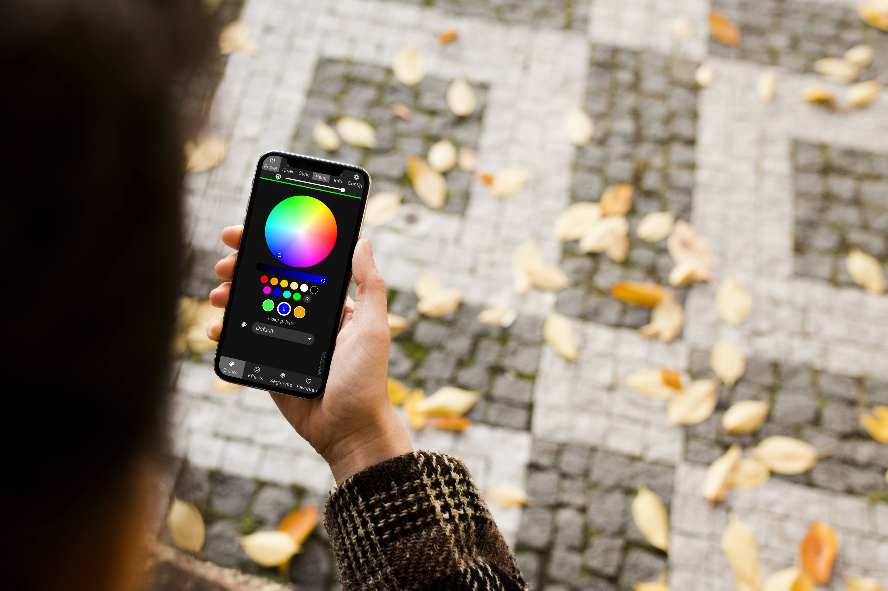

### Chào mừng đến với bộ điều khiển led ARGB! ✨

- [Basics - Bắt đầu cơ bản](basics/getting-started)

- [Features - Effects - Hiệu ứng](features/effects) 

**Triển khai nhanh chóng** và nhiều tính năng để điều khiển đèn **LED NeoPixel** (WS2812B, WS2811, SK6812, ...) hoặc các chipsets dựa trên SPI như WS2801 và APA102!

### 💡 Các loại chip Led được hổ trợ

| **SPI 3-wire**        | **SPI 4-wire**          | **PWM**              | **Others**              |
|-----------------------|-------------------------|----------------------|-------------------------|
| WS281x                | APA102                  | WS2811 White         | On/Off                  |
| SK6812/WS2814 RGBW    | LPD8806                 | PWM White            | DDP RGB (network)       |
| TM1814                | LPD6803                 | PWM CCT              | E1.31 RGB (network)     |
| 400kHz                | P9813                   | PWM RGB              | Art-Net RGB (network)   |
| TM1829                |                         | PWM RGBW             | DDP RGBW (network)      |
| UCS8903               |                         | PWM RGB+CCT          |                         |
| UCS8904 RGBW          |                         | PWM RGB+DCCT         |                         |
| WS2801                |                         |                      |                         |

#### ⚙️ Tính năng

- Thư viện **WS2812FX** tích hợp cho **hơn 180 hiệu ứng đặc biệt**
- Hiệu ứng **FastLED** và 50 bảng màu
- Giao diện hiện đại với điều khiển màu sắc, hiệu ứng và **phân đoạn Led**
- **Phân đoạn** để đặt các hiệu ứng và màu sắc khác nhau **cho các phần của đèn LED**
- Két nối mạng wifi thông minh.
- Tối đa **10 ngõ đầu ra kết nối đèn LED** cho mỗi instance ARGB v1.0.0 (**mỗi đầu ra 800 leds**)
- Có thể kết nối không giới hạn các ARGB v1.0.0
- Hỗ trợ dải đèn **RGBW**
- **Tối đa 250 Preset** của người dùng để dễ dàng lưu và tải màu sắc/hiệu ứng, hỗ trợ chuyển đổi qua lại giữa chúng
- **Preset** có thể được sử dụng để tự động thực thi các lệnh API
- Chức năng đèn ngủ (giảm dần độ sáng)
- Cập nhật phần mềm OTA đầy đủ (HTTP + ArduinoOTA), có thể bảo vệ bằng mật khẩu.
- Đồng hồ analog có thể cấu hình + **hỗ trợ bộ kit Cronixie của Diamex**
- Giới hạn độ sáng tự động có thể cấu hình để hoạt động an toàn hơn.
- Cấu hình dựa trên hệ thống tập tin để **dễ dàng sao lưu cài đặt** trước và cài đặt.

<!-- - Native [Home-Assistant integration](https://www.home-assistant.io/integrations/wled/):  -->

#### 💡 Các phần mềm kết nối chuyên nghiệp hơn ARGB có thể sử dụng
- [Jinx! – LED Matrix Control](https://live-leds.de/) - điều khiển led chuyên nghiệp cho bảng ma trận LED
- [LedFx - Make your LEDs dance in sync to the music](https://www.ledfx.app/) - điều khiển led theo nhạc cực cuốn
- [Lightpack - Prismatik](https://github.com/psieg/Lightpack/releases) - trang trí **Ambilight** cho màn hình PC/Laptop
- [Hyperion](https://github.com/hyperion-project/hyperion.ng) - Trang trí TIVI siêu đẹp

#### 💡 Các chuẩn kết nối ARGB có thể sử dụng

<!-- - [ARGB app](https://github.com/Aircoookie/WLED-App) for [Android](https://play.google.com/store/apps/details?id=com.aircoookie.WLED) and [iOS](https://apps.apple.com/us/app/wled/id1475695033)
- Alternatively, ARGB Native app made by community member [Moustachauve](https://github.com/Moustachauve) -->
- Ứng dụng **điện thoại di động** [Android](https://play.google.com/store/apps/details?id=ca.cgagnier.wlednativeandroid) 
<!-- - [[Source]((https://github.com/Moustachauve/WLED-Native-Android))] -->
- Ứng dụng **điện thoại di động** [iOS](https://apps.apple.com/us/app/wled-native/id6446207239) 
<!-- - [[Source]((https://github.com/Moustachauve/WLED-Native-iOS/))] -->
<!-- - [JSON](interfaces/json-api) and [HTTP request](interfaces/http-api) APIs   -->
<!-- - [MQTT](interfaces/mqtt)   -->
<!-- - [Blynk IoT](interfaces/blynk)   -->
- [E1.31](interfaces/e1.31-dmx), [Art-Net](interfaces/e1.31-dmx), DDP and [TPM2.net](interfaces/udp-realtime)
- [UDP realtime](interfaces/udp-realtime)
- [Alexa voice control (including dimming and color)](/advanced/remote-access-ifttt)
- [Sync to Philips Hue lights](interfaces/philips-hue)
- Adalight (PC ambilight via serial) và TPM2 -> Trang trí màn hình PC/Laptop siêu đẹp
- [Sync color of multiple ARGB devices (UDP notifier)](interfaces/udp-notifier)
- [Infrared remotes (24-key RGB, receiver required)](interfaces/infrared)
- Simple timers/schedules (time from NTP, timezones/DST supported)  

#### 📲 Hướng dẫn sử dụng nhanh và tài liệu liên quan

[Hướng dẫn sử dụng nhanh!](basics/getting-started)

[Trên trang này](basics/tutorials), bạn có thể tìm thấy các hướng dẫn tuyệt vời do cộng đồng thực hiện và các công cụ hữu ích để giúp bạn thiết lập và vận hành chiếc đèn mới của mình!

#### 🖼️ User interface

<!-- #### 💾 Compatible hardware

See [here](basics/compatible-hardware)! -->

<!-- #### ✌️ Other

Licensed under the MIT license   -->

## ✌️ Happy Smart Light - bangnguyendev

## 💡 Điều Khiển LED Qua DDP, UDP, TMP2

`JINX! `là một phần mềm mạnh mẽ để điều khiển LED thông qua các giao thức như DDP, UDP, và TMP2. Nếu bạn đang tìm kiếm các phần mềm tương tự có khả năng điều khiển LED qua các giao thức này, dưới đây là một số lựa chọn:

### 💡 1. xLights
- **Mô tả**: xLights là một phần mềm lập trình ánh sáng phổ biến, hỗ trợ nhiều loại LED và có khả năng điều khiển thông qua các giao thức như E1.31 (sACN), DDP, và Art-Net.
- **Tính năng nổi bật**: Lập trình ánh sáng theo bài hát, mô phỏng 3D, hỗ trợ nhiều bộ điều khiển.

### 💡 2. Madrix
- **Mô tả**: Madrix là một phần mềm điều khiển ánh sáng LED chuyên nghiệp, hỗ trợ nhiều giao thức điều khiển như Art-Net, sACN, và DDP.
- **Tính năng nổi bật**: Hiệu ứng ánh sáng mạnh mẽ, giao diện người dùng thân thiện, hỗ trợ điều khiển thời gian thực.

### 💡 3. Glediator
- **Mô tả**: Glediator là một phần mềm mã nguồn mở để điều khiển ma trận LED. Nó hỗ trợ giao thức điều khiển như UDP.
- **Tính năng nổi bật**: Đơn giản, dễ sử dụng, có khả năng tạo hiệu ứng ánh sáng đa dạng.

### 💡 4. QLC+ (Q Light Controller Plus)
- **Mô tả**: QLC+ là một phần mềm điều khiển ánh sáng mã nguồn mở, hỗ trợ nhiều giao thức điều khiển như Art-Net, sACN, và DMX.
- **Tính năng nổi bật**: Hỗ trợ nhiều loại thiết bị ánh sáng, giao diện dễ sử dụng, nhiều tính năng lập trình ánh sáng.

### 💡 5. Resolume
- **Mô tả**: Resolume là một phần mềm VJing mạnh mẽ, hỗ trợ điều khiển ánh sáng LED thông qua các giao thức như Art-Net và sACN.
- **Tính năng nổi bật**: Khả năng tạo hiệu ứng video và ánh sáng kết hợp, hỗ trợ điều khiển thời gian thực.

### 💡 6. LedEdit
- **Mô tả**: LedEdit là một phần mềm điều khiển LED phổ biến, hỗ trợ nhiều loại điều khiển LED thông qua UDP và các giao thức khác.
- **Tính năng nổi bật**: Đơn giản, dễ sử dụng, hỗ trợ nhiều bộ điều khiển LED.

{: .box-warning}
**Mục này dành cho nạp lại bo mạch:** Đối với mạch điều khiển LED **ARGB Happy Smart Light** chỉ có tiếng Việt cho chip **ESP32** và **ESP32-S3**.

<!-- Sử dụng cho button class="action action--button" -->
<link rel="stylesheet" href="/dist/css/main-bio.css"> 

  <h4>ESP Web Tools - bangnguyendev</h4>
  <!-- Lựa chọn các option -->
  

    <label for="optiongroup">Chọn phiên bản:</label>
    <select id="optiongroup">
      <optgroup label="ARGB Led tiếng Việt">
        <option value="/dist/json/manifest_ESP8266_ESP32_ARGB_VN.json">ARGB Led - v1.0.0_VN</option>
      </optgroup>
      <optgroup label="ARGB Led">
        <option value="/dist/json/manifest_ESP8266_ESP32_ARGB.json">ARGB Led - v1.0.0</option>
     </optgroup>
      <optgroup label="Example ESP Web Tools - OTA">
        <option value="/dist/json/manifest_ESP8266_ESP32.json">ESP Web Tools - OTA - v1.0.0</option>
      </optgroup>
    </select>
  

  Kết nối <a href="https://s.shopee.vn/4Aewn9TB7g"><b>USB-TTL</b></a> với bo mạch <b>ARGB Happy Smart Light</b>.  Cắm <b>USB-TTL</b> vào máy tính của bạn.  Phiên bản đang chá»n:  
  <!-- Button install ESP -->
  <esp-web-install-button id="espInstallButton">
  <button class="action action--button" slot="activate"><i class="fa fa-usb"></i>Kết nối & Cài đặt</button>
  </esp-web-install-button>

