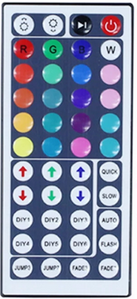
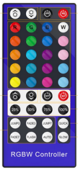
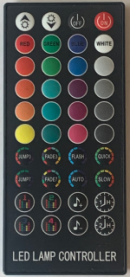
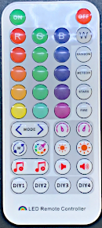
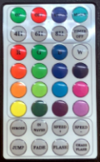
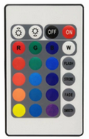
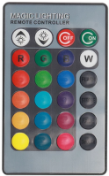
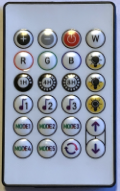
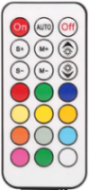

Một module thu hồng ngoại chuyên dụng là cần thiết.  
(KY-022 hoặc TSOP38238 được xác nhận hoạt động tốt và giá rẻ)

Mặc định, chân cảm biến là GPIO4. Bạn có thể thay đổi nó trong cài đặt của WLED.

### JSON IR Remote
JSON IR remote cho phép người dùng tùy chỉnh hành vi của remote hồng ngoại mà không cần viết code C tùy chỉnh hay biên dịch lại. Sử dụng JSON IR remote, bạn có thể gán các nút trên bất kỳ remote tương thích nào với bất kỳ lệnh HTTP request API hoặc JSON API nào.

Bản đồ mã IR tới lệnh API được lưu trên hệ thống file của ESP trong `ir.json`. Từ trang "LED Preferences", thiết lập chân IR và loại remote thành "JSON remote". Khi "JSON remote" được chọn, một điều khiển upload file sẽ xuất hiện. Bạn cũng có thể tải lên và chỉnh sửa `ir.json` từ trang /edit, truy cập bằng cách đi đến http://[địa chỉ-ip-controller]/edit. Nếu bạn sử dụng trang chỉnh sửa để tải file cấu hình, hãy chắc chắn đặt tên file là `ir.json`.

### Remote được cấu hình sẵn
Remote LED thường không được bán riêng. Tuy nhiên, bạn có thể mua kèm với bộ điều khiển RGB với giá $2-4 trên AliExpress và $5-10 trên Amazon. Khi mua remote, hãy chắc chắn rằng đó là remote hồng ngoại (IR), không phải remote sóng radio (RF), vì hiện tại chúng không được hỗ trợ.

[](https://www.aliexpress.com/item/32714274390.html)  
44-key trắng  
[ir.json](44-key_ir.json)

[](https://www.aliexpress.com/item/1005001873663294.html)  
40-key xanh  
[ir.json](40-key-blue_ir.json)

  
40-key đen  
[ir.json](40-key-black_ir.json)

[](https://www.aliexpress.com/item/1005002944086008.html)  
38-key [ir.json](38-key_ir.json) (Bán kèm với bộ điều khiển SP511E tương thích WLED)

  
32-key [ir.json](32-key_ir.json) (Thường được bán kèm với đèn dây fairy)

[](https://www.aliexpress.com/item/4001348058175.html)  
24-key (rất phổ biến, nhưng cần gán lại nút để hữu dụng hơn với WLED)  
*    [ir.json v1](24-key_ir.json) nút xám tải preset 1-4  
*    [ir.json v2](24-key-v2_ir.json) nút xám chuyển hiệu ứng, bảng màu và thay đổi tốc độ  

[](https://www.aliexpress.com/item/4000704528801.html)  
24-key xám  
[ir.json](24-key-grey_ir.json)

  
24-key music  
[ir.json v3](24-key-v3_ir.json)

[](https://www.aliexpress.com/item/1005001319234216.html)  
21-key  
[ir.json](21-key_ir.json)

  
18-Key Silver  
[ir.json](18-key-ir.json)

[](https://www.aliexpress.com/item/33014078844.html)  
6-key  
[ir.json](6-key_ir.json)

### Chỉnh sửa `ir.json`
Trước tiên, hãy xem liệu đã có file JSON cho remote của bạn chưa. Nếu không, hãy kiểm tra xem có file JSON nào cho remote có số nút tương tự hay không. Thường thì remote với số nút giống nhau sẽ có nhãn khác nhau nhưng phát ra cùng một mã. Các key trong JSON là mã IR được mã hóa hex do mỗi nút phát ra. Các key là chuỗi và phân biệt chữ hoa thường, hãy chắc chắn sử dụng đúng định dạng như ví dụ bên dưới. Đây cũng là định dạng sử dụng khi mã được in ra trên serial console.

Trong tài liệu JSON, mỗi đối tượng nút cần có thuộc tính `cmd` chứa lệnh HTTP request hoặc lệnh JSON API. Ngoài các lệnh HTTP và JSON API, một số hàm C cũng được hỗ trợ (!incBrightness, !decBrightness, !presetFallback). Các hàm này giúp tăng giảm độ sáng từng bước nhỏ ở đầu dải và lớn dần ở cuối dải. Hàm !presetFallback áp dụng một preset (thuộc tính PL) và dự phòng sang hiệu ứng và bảng màu chỉ định (thuộc tính FX và FP) nếu preset không tồn tại (xem ví dụ bên dưới).

Nếu một nút trên remote IR được nhấn liên tục hoặc giữ, các lần nhấn tiếp theo sẽ có mã khác (0xFFFFFFFF). Nếu lệnh của bạn có thể lặp lại nhưng không chứa ký tự "~" và không gọi incBrightness hoặc decBrightness, hãy thêm thuộc tính "rpt" với giá trị true. Thuộc tính nhãn (label) và vị trí (position) sẽ bị WLED bỏ qua nhưng hữu ích khi chỉnh sửa.

Nếu không có sẵn file `ir.json` cho remote của bạn, bạn sẽ cần xác định mã mà mỗi nút phát ra. Để làm điều này, kết nối ESP8266 hoặc ESP32 của bạn với máy tính và mở serial monitor trong Arduino hoặc VSCode. Sau đó nhấn từng nút và ghi lại mã được in ra trên serial monitor. Bạn sẽ thấy điều gì đó như sau:

```bash
IR recv
0xFFDE10
```

Bạn sẽ nhận được một số nguyên mã hex 24-bit. Nếu bạn thấy 0xFFFFFFFF, điều đó có nghĩa là nút đã bị nhấn lặp lại hoặc giữ. Hãy thử nhấn nhanh.

### Mẹo
* Gán nút `play` hoặc `auto` vào một danh sách phát. Hiện tại chúng chỉ bật preset cycling `CY=1` hoặc tải một danh sách phát gồm preset 1-5. Bạn có thể định nghĩa danh sách phát trong `ir.json` như ví dụ dưới đây, hoặc lưu danh sách phát dưới dạng một preset và tải nó.
* Lưu các preset sử dụng hàng ngày của bạn trong một dải ID, ví dụ 1-30; các preset ngày lễ trong dải khác, ví dụ 31-40. Sau đó, bạn có thể dành hai nút để chuyển qua lại giữa các preset. Trong ví dụ của chúng ta, lệnh trên nút 'holiday cycle' sẽ là `P1=31&P2=40&PL=~`
* Bạn cũng có thể nhóm preset theo màu sắc; ví dụ các hiệu ứng màu đỏ ở 1-10, màu xanh lá cây ở 11-20, màu xanh lam ở 21-30. Remote 44-key có các mũi tên lên và xuống cho màu đỏ, xanh lá và xanh lam. Vì vậy, lệnh trên nút 'blue down' sẽ là `P1=21&P2=30&PL=~-`
* Hầu hết các remote 24-key và ít nút hơn được thiết kế với các đèn LED analog và không có nhãn hữu dụng cho WLED. Với JSON IR và bút Sharpie đầu nhọn, bạn có thể thay đổi mục đích sử dụng của các nút để chúng hữu dụng hơn.

### Ví dụ `ir.json`


```json
{
  "0xF740BF": {
    "label": "On/Off",
    "cmd": "T=2",
    "rpt": true
  },
  "0xF700FF": {
    "label": "Speed +",
    "cmd": "SX=~16"
  },
  "0xF720DF": {
    "label": "Red",
    "cmnt": "Lava palette + primary, secondary and tertiary colors",
    "cmd": "FP=8&CL=hFF7F00&C2=hFF0000&C3=hCC3D60"
  }, 
  "0xF710EF": {
    "label": "Timer1",
    "cmnt": "Timer 60 min",
    "cmd": "NL=60&NT=0"
  },
  "0xF730CF": {
    "label": "Play",
    "cmnt": "prime example of a playlist that cycles every 180 seconds and continues to repeat",
    "cmd": {"playlist":{"ps":[1,3,5,7,11,13,17],"dur": 1800,"transition":7,"repeat":0,"end":0}}
  }, 
  "0xFF9867": {
    "label": "Bright+",
    "cmnt": "smaller steps at beginning, larger steps at the end",
    "cmd": "!incBrightness"
  },
  "0xF78877": {
    "label": "DIY1",
    "cmnt": "Preset 1, fallback to Saw(16) - Party(6) if it doesn't exist",
    "cmd": "!presetFallback",
    "PL": 1,
    "FX": 16,
    "FP": 6
  },
}
```


!!! info "Version Info"
    Since v0.13.0, infrared control for any IR remote compatible with your IR receiver with JSON remote.

A dedicated infrared receiver module is required.
(KY-022 or TSOP38238 are confirmed to work and inexpensive)

The default sensor pin is GPIO4. It can be changed in the WLED settings.

### JSON IR Remote
The JSON IR remote allows users to customize IR remote behavior without writing custom C 
code or compiling. Using the JSON IR remote, you can map buttons from any compatible 
remote to any HTTP request API or JSON API command. 

The map of IR codes to API commands is stored on your ESP's file system in `ir.json`. 
From the "LED Preferences" page, set the IR pin and remote type to "JSON remote". Once "JSON remote" is selected, 
a file upload control will appear. You can also upload and edit ir.json from the /edit page, which can be reached by going to
http://[controller-ip]/edit. If you use the edit page to upload your config file, be sure to name it `ir.json`.

### Preconfigured Remotes
LED remotes typically are not sold separately. But you can purchase with an RGB controller for $2-4 on AliExpress and $5-10 on Amazon. 
When purchasing a remote, be sure that it is an infrared (IR) remote and not a radio (RF) remote as they are not supported at this time.

[](https://www.aliexpress.com/item/32714274390.html)
44-key white 
[ir.json](44-key_ir.json)

[](https://www.aliexpress.com/item/1005001873663294.html)
40-key blue
[ir.json](40-key-blue_ir.json)


40-key black 
[ir.json](40-key-black_ir.json)

[](https://www.aliexpress.com/item/1005002944086008.html)
38-key [ir.json](38-key_ir.json) (Sold with WLED compatible SP511E controllers)

 
32-key [ir.json](32-key_ir.json) (commonly sold with fairy string lights)

[](https://www.aliexpress.com/item/4001348058175.html)  
24-key (very common, but buttons need repurposed to be very useful with WLED)  
*    [ir.json v1](24-key_ir.json) gray buttons load presets 1-4  
*    [ir.json v2](24-key-v2_ir.json) gray buttons cycle effects, palettes and change speed  

[](https://www.aliexpress.com/item/4000704528801.html)
24-key grey
[ir.json](24-key-grey_ir.json)


24-key music
[ir.json v3](24-key-v3_ir.json)

[](https://www.aliexpress.com/item/1005001319234216.html)
21-key
[ir.json](21-key_ir.json)


18-Key Silver
[ir.json](18-key-ir.json)

[](https://www.aliexpress.com/item/33014078844.html)
6-key
[ir.json](6-key_ir.json)

### Editing ir.json
First see if a JSON file already exists for your remote. If not, see if there is a JSON file for a remote with 
the same number of buttons. Often remotes with the same number of buttons have different labels but emit the 
same codes. The JSON keys are the hex encoded IR codes emitted by each button.  The keys are strings and case is important, 
be sure to use the same format as the sample below. It is also the same format used when codes are echoed on the serial console. 

In the JSON document, each button object should have a `cmd` attribute containing the HTTP request or JSON API command. 
In addition to HTTP and JSON API commands, several C functions are supported (!incBrightness, !decBrightness, !presetFallback).
The !incBrightness and !decBrightness functions, take smaller steps at the dim end of the range with progressively larger steps at the bright end.
The !presetFallback function applies a preset (attribute PL) and falls back to the specified effect and palette (attributes FX and FP) if preset does not exist. (see sample below)

If an IR remote button is pressed rapidly or held down, subsequent presses have a different code (0xFFFFFFFF). 
If your command is repeatable but does not contain the "~" character and is not calling incBrightness or decBrightness, then add a "rpt" attribute with a value of true. 
Label and position attributes are ignored by WLED but useful when making edits. 

If an ir.json file does not already exist for your remote, you will need to determine what code each button emits. To do this, connect your ESP8266 or ESP32 to a computer and 
open Arduino or VSCode serial monitor. Then press each button and record the code printed on the serial monitor. You should see something like this:

```bash
IR recv
0xFFDE10
```

You should get a 24-bit hex encoded integer. If you get 0xFFFFFFFF, that means the button has been pressed repeatedly or held down. Try tapping quickly.

### Tips
* Map `play` or `auto` buttons to a playlist. They currently just turn on preset cycling `CY=1` or load a playlist of presets 1-5. You can define the playlist in ir.json as in the sample below, or save a playlist as a preset and load that.
* Save your 'every day' presets in one range of ids, maybe 1-30; your 'holiday' presets in another range, maybe 31-40. Then you can devote two buttons to cycle through presets. In our example, the command on the 'holiday cycle' button would be `P1=31&P2=40&PL=~`
* You can also group your presets by color; for instance reddish animations in 1-10, greenish in 11-20, bluish in 21-30. The 44-key remote has up and down arrows for red, green and blue. So the command on the 'blue down' button would be `P1=21&P2=30&PL=~-` 
* Most of the 24-key and fewer remotes are designed with analog LEDs in mind and do not have very useful labels for WLED. With JSON IR and a fine-tip Sharpie, you can repurpose buttons to make them more useful.

### ir.json sample

```json
{
  "0xF740BF": {
    "label": "On/Off",
    "cmd": "T=2",
    "rpt": true
  },
  "0xF700FF": {
    "label": "Speed +",
    "cmd": "SX=~16"
  },
  "0xF720DF": {
    "label": "Red",
    "cmnt": "Lava palette + primary, secondary and tertiary colors",
    "cmd": "FP=8&CL=hFF7F00&C2=hFF0000&C3=hCC3D60"
  }, 
  "0xF710EF": {
    "label": "Timer1",
    "cmnt": "Timer 60 min",
    "cmd": "NL=60&NT=0"
  },
  "0xF730CF": {
    "label": "Play",
    "cmnt": "prime example of a playlist that cycles every 180 seconds and continues to repeat",
    "cmd": {"playlist":{"ps":[1,3,5,7,11,13,17],"dur": 1800,"transition":7,"repeat":0,"end":0}}
  }, 
  "0xFF9867": {
    "label": "Bright+",
    "cmnt": "smaller steps at beginning, larger steps at the end",
    "cmd": "!incBrightness"
  },
  "0xF78877": {
    "label": "DIY1",
    "cmnt": "Preset 1, fallback to Saw(16) - Party(6) if it doesn't exist",
    "cmd": "!presetFallback",
    "PL": 1,
    "FX": 16,
    "FP": 6
  },
}
```
